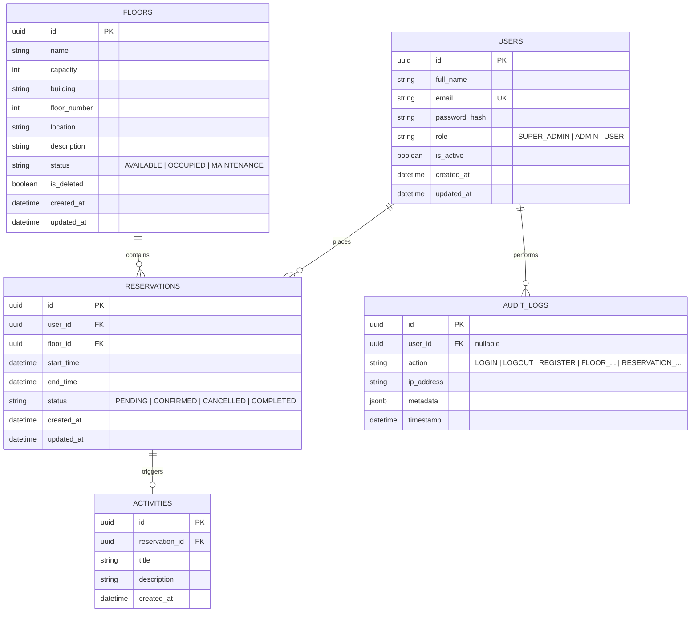

# Technical Documentation: Bookini Smart Floor Reservation System

Welcome to the technical documentation of **Bookini**, a production-ready, containerized Smart Floor Reservation System. This system allows users to reserve rooms, desks, and floors, while providing administrators with occupancy monitoring, audit logs, statistics, and observability.

---

## Table of Contents
1. [Project Overview & Business Goal](#1-project-overview--business-goal)
2. [Project Directory Tree](#2-project-directory-tree)
3. [Clean Architecture & Code Patterns](#3-clean-architecture--code-patterns)
4. [Database Schema (Mermaid)](#4-database-schema)
5. [Environment Variables Reference](#5-environment-variables-reference)
6. [Technology Stack Details](#6-technology-stack-details)
7. [CI/CD Pipeline Details](#7-cicd-pipeline-details)
8. [Database Seeding Model](#8-database-seeding-model)
9. [Key Fixes & Troubleshooting History](#9-key-fixes--troubleshooting-history)

---

## 1. Project Overview & Business Goal

Bookini is designed to solve office occupancy and reservation challenges. It features:
- **Interactive Floor Layouts**: 2D canvas editors for administrators to set up floors, desks, and equipment (projectors, plants, walls).
- **Self-Service Reservations**: Users can browse available places, select floors, view interactive plans, and reserve spaces.
- **Audit & Observability**: Complete audit logs of every sensitive action, paired with a full metrics/logs/tracing monitoring stack.
- **Containerized Deployments**: Run via Docker Compose, routed securely via Traefik.

---

## 2. Project Directory Tree

The workspace is organized into a modular multi-service repository structure:

```
bookini/
├── .github/
│   └── workflows/
│       └── ci.yml                     # CI/CD GitHub Actions Pipeline
├── admin-frontend/                    # Admin Panel (React/Vite/TS/MUI)
│   ├── src/
│   │   ├── app/                       # Routing, providers, and themes
│   │   └── features/                  # Module-focused workspaces and sections
│   ├── Dockerfile
│   └── vite.config.ts
├── backend/                           # API Backend (FastAPI/Python/SQLAlchemy)
│   ├── app/
│   │   ├── api/                       # API controllers and versioning
│   │   ├── core/                      # Configuration, seeding, logging, security
│   │   ├── domain/                    # Entities, DTOs, and schemas
│   │   ├── infrastructure/            # Database session and Minio configs
│   │   ├── models/                    # SQLAlchemy database entities
│   │   └── repositories/              # Repository query abstractions
│   ├── alembic/                       # DB migrations
│   ├── tests/                         # Pytest test suite
│   ├── Dockerfile
│   └── requirements.txt
├── frontend/                          # User Booking Panel (React/Vite/TS/MUI)
│   ├── src/                           # Source files
│   └── Dockerfile
├── monitoring/                        # Observability configuration
│   ├── grafana/                       # Dashboards and provisioned datasources
│   ├── loki/                          # Loki log aggregation configs
│   ├── prometheus/                    # Metric collection targets
│   └── promtail/                      # Log forwarding collector
├── traefik/                           # Reverse proxy configuration
├── docker-compose.yml                 # Master services orchestrator
├── docker-compose.prod.yml            # Production environment compose file
└── TECHNICAL_DOCUMENTATION.md         # This document
```

---

## 3. Clean Architecture & Code Patterns

The python backend follows **Clean Architecture** principles to separate concerns, isolate business logic, and ensure the core domain remains independent of external frameworks.

```
       ┌────────────────────────────────────────────────────────┐
       │                 Presentation Layer                     │
       │     - FastAPI Routes (app/presentation)                │
       │     - Input / Output Schemas (app/schemas)             │
       └───────────────────────────┬────────────────────────────┘
                                   │ (Calls)
                                   ▼
       ┌────────────────────────────────────────────────────────┐
       │                  Application Layer                     │
       │     - Business Services (app/services)                 │
       │     - State Stores / Core Handlers                     │
       └───────────────────────────┬────────────────────────────┘
                                   │ (Calls)
                                   ▼
       ┌────────────────────────────────────────────────────────┐
       │                  Infrastructure Layer                  │
       │     - DB Sessions (app/infrastructure)                 │
       │     - Repository Queries (app/repositories)            │
       │     - External Clients (MinioClient, Redis)            │
       └───────────────────────────┬────────────────────────────┘
                                   │ (Manipulates)
                                   ▼
       ┌────────────────────────────────────────────────────────┐
       │                     Domain Layer                       │
       │     - Core Database Models (app/models)                │
       │     - Enums & Value Objects (app/domain)               │
       └────────────────────────────────────────────────────────┘
```

### Layer Definitions & Data Flow
1. **Domain Layer** (`app/models` & `app/domain`): Defines core entities (e.g. `User`, `Reservation`, `Floor`) and basic enums (`UserRole`, `ReservationStatus`). Business rules live here and have zero external dependencies.
2. **Infrastructure Layer** (`app/infrastructure`): Implements database engines, external cloud adapters (e.g., `MinioClient` for S3 blueprint storage), and session scopes.
3. **Repository Layer** (`app/repositories`): Abstracts database queries using the Repository Pattern. All SQL and SQLAlchemy queries are contained here (e.g., `UserRepository`).
4. **Service Layer** (`app/services`): Coordinates business workflows and operations (e.g., verifying desk availability before creating a reservation). Services call repositories and map results.
5. **Presentation Layer** (`app/presentation` & `app/schemas`): The entrypoint of the application. It maps HTTP requests to services, validates request payloads with Pydantic schemas, and handles HTTP exceptions.

---

## 4. Database Schema

The database utilizes PostgreSQL 16. The schema tables, relationships, and constraints are detailed below:



---

## 5. Environment Variables Reference

The system relies on environment variables for runtime configuration. They are divided by service:

### Backend Configuration
| Variable Name | Description | Default Value | Required |
| :--- | :--- | :--- | :--- |
| `APP_ENV` | Running environment (`development`, `staging`, `production`) | `development` | No |
| `LOG_LEVEL` | Logging verbosity (`DEBUG`, `INFO`, `WARNING`, `ERROR`) | `INFO` | No |
| `SECRET_KEY` | Symmetric key used to sign JWT tokens (Min 16 chars) | None | **Yes** |
| `DATABASE_URL` | SQLAlchemy async connection string to PostgreSQL | None | **Yes** |
| `REDIS_URL` | Connection string to Redis instance for caching | `redis://redis:6379/0` | No |
| `SEED_SUPER_ADMIN` | Toggle whether to bootstrap the Super Admin account | `true` | No |
| `SEED_SUPER_ADMIN_EMAIL` | Email for the bootstrapped Super Admin | `superadmin@bookiwa7dek.com` | No |
| `SEED_SUPER_ADMIN_PASSWORD`| Password for the bootstrapped Super Admin | `SuperAdmin123456!` | No |
| `MINIO_ENDPOINT` | Host and port of the S3-compatible MinIO server | `minio:9000` | No |
| `MINIO_ACCESS_KEY` | MinIO admin access username | `minioadmin` | No |
| `MINIO_SECRET_KEY` | MinIO admin access secret key | `minioadmin` | No |
| `MINIO_BUCKET` | The bucket name where blueprint images are stored | `bookini` | No |

### Frontend & Admin Configuration
| Variable Name | Description | Default Value | Required |
| :--- | :--- | :--- | :--- |
| `BACKEND_IMAGE` | Pushed backend Docker tag to pull on VPS | None | **Yes (CI)** |
| `FRONTEND_IMAGE` | Pushed frontend Docker tag to pull on VPS | None | **Yes (CI)** |
| `ADMIN_FRONTEND_IMAGE`| Pushed admin-frontend Docker tag to pull on VPS | None | **Yes (CI)** |
| `DOMAIN_NAME` | Main domain used by Traefik for reverse proxy routing | None | **Yes** |

### Monitoring & Dashboard Configuration
| Variable Name | Description | Default Value | Required |
| :--- | :--- | :--- | :--- |
| `GRAFANA_ADMIN_USER` | Grafana dashboard administrator username | None | **Yes** |
| `GRAFANA_ADMIN_PASSWORD`| Grafana dashboard administrator password | None | **Yes** |

---

## 6. Technology Stack Details

### Frontend & Admin Portal
- **Framework**: React 19 (via Vite 8 for fast building).
- **Language**: TypeScript (with strict compiler flags including `verbatimModuleSyntax`).
- **Styling**: Material UI (MUI) for a cohesive and clean design system.
- **State Management**: `@tanstack/react-query` for API caching and mutation states.
- **Testing**: Vitest + `@testing-library/react` running in a `jsdom` environment.

### Backend
- **Framework**: FastAPI (built on top of Starlette and Uvicorn).
- **ORM & DB Connection**: SQLAlchemy (Async Engine) + Alembic (migration manager).
- **Linting & Code Style**: Ruff (replaces Black, Flake8, and isort).
- **Testing**: Pytest + `pytest-asyncio`.
- **Security Scan**: `pip-audit` for resolving PyPI dependencies vulnerability.

### Infrastructure & Reverse Proxy
- **Containerizer**: Docker Engine + Compose.
- **Reverse Proxy / Router**: Traefik v3 (integrates Let's Encrypt for automatic HTTPS/TLS).
- **S3 Storage**: MinIO (local S3 mockup for mock floor plan blueprints).

### Observability
- **Prometheus**: Scrapes metrics from `/metrics` endpoint.
- **Grafana**: Visualizes metrics through provisioned dashboards (System, DB, and Business metrics).
- **Loki & Promtail**: Forward and aggregate stdout container logs.
- **cAdvisor & Node Exporter**: Track server memory, CPU, and running container stats.

---

## 7. CI/CD Pipeline Details

The GitHub Actions pipeline is defined in [.github/workflows/ci.yml](file:///c:/Users/WISSEM%20HAMOUDI/Desktop/Projects/bookini/.github/workflows/ci.yml). 

```
 ┌───────────────┐      ┌───────────────┐      ┌────────────────────┐
 │  Push / PR to │ ───> │ Quality Gates │ ───> │   Docker Images    │
 │master/develop │      │(Test & Lint)  │      │(Build, Scan, Push) │
 └───────────────┘      └───────────────┘      └─────────┬──────────┘
                                                         │
                                                         ▼
                                               ┌────────────────────┐
                                               │Staging Deploy (VPS)│
                                               │- Dynamic Checkout  │
                                               │- Compose Pull & Up │
                                               └────────────────────┘
```

### Flow Execution Steps:
1. **Quality Gates (Parallel Runs)**:
   - **Backend Quality**: Runs `Ruff` checks, `Pytest` suite, and `pip-audit` on the python environment.
   - **Frontend Quality**: Runs `ESLint`, compiles typescript, runs `Vitest` unit tests, and compiles the production bundles.
   - **Admin Frontend Quality**: Runs `ESLint`, compiles typescript, and runs `Vitest` unit tests.
2. **Build, Scan, and Push (Only on pushes to `master` or `develop`)**:
   - Builds Docker images for the three services using Docker Buildx and caches intermediate layers (`type=gha`).
   - Logs into Docker Hub using credentials stored in GitHub Secrets.
   - **Trivy Image Scan (`aquasecurity/trivy-action@v0.36.0`)**: Scans all three images for HIGH and CRITICAL vulnerabilities. If any unignored OS-level vulnerability is found, the build fails.
   - Pushes secure images to Docker Hub (tagged with both `latest` and target `${{ github.sha }}`).
3. **Staging Deploy (Only on pushes to `master` or `develop`)**:
   - Connects to the Staging VPS via SSH (`appleboy/ssh-action@v1.0.3`).
   - **Dynamic Git Checkout**: Executes `git fetch`, `git checkout`, and `git pull` on the remote server using the dynamic branch name **`${{ github.ref_name }}`**. This ensures that the correct compose configurations are loaded (e.g. including the `admin-frontend` service when deploying `develop`).
   - Runs `docker compose pull` and restarts the container orchestration cluster.

---

## 8. Database Seeding Model

Bookini uses a single-point startup seeding model to minimize test database pollution and maintain clean production credentials:

- **Super Admin Account Seeding**: 
  On application startup, the service check in [seed.py](file:///c:/Users/WISSEM%20HAMOUDI/Desktop/Projects/bookini/backend/app/core/seed.py) verifies if the database has a Super Admin account matching `settings.seed_super_admin_email`. If none exists, it creates the admin account with the hashed password configured in `settings.seed_super_admin_password`.
- **Default Users Seeding Removal**:
  The historical `seed_default_users` function (which created mock user/admin accounts such as `admin@bookiwa7dek.com` and `user@bookiwa7dek.com`) was removed. This ensures that the production database starts with exactly one account: the Super Admin platform director.

---

## 9. Key Fixes & Troubleshooting History

Here is a summary of the key configuration and compilation resolutions implemented:

### Vitest Test & Context Fixes
- **Missing Provider Context**: Wrapped the `LoginPage` component within `<ColorModeProvider>` inside `login-page.test.tsx` (in both `frontend` and `admin-frontend`) to avoid the context hook error `useColorMode must be used within ColorModeProvider`.
- **ESM Directory Imports in Node**: Added `server.deps.inline: ['@mui/material', 'react-transition-group']` to `vite.config.ts`. This resolves Node's strict ESM restriction `Directory import ... is not supported` by forcing Vitest to compile these folders through Vite's pipeline.
- **Mismatching Assertions**: Corrected test expectations in `admin-frontend/src/app/router.test.tsx` to search for `/sign in to continue/i` (the actual login header) rather than `/welcome back/i`.

### TypeScript Compilations
- **Type-only Imports**: Refactored `dashboard-page.tsx` to import `ReservationItem` as a type (`import type { ReservationItem }`) to comply with strict TS compilation when `verbatimModuleSyntax` is enabled.
- **ElementType Casts**: Cast dropdown selections (`e.target.value as ElementType`) in `floor-management-section.tsx` to satisfy compiler checks preventing generic `string` inputs where a specific literal union type is expected.

### Docker & Trivy Scanning
- **Debian Base Image Patches**: Added `&& apt-get upgrade -y` inside `backend/Dockerfile`.
- **Alpine Base Image Patches**: Added `RUN apk upgrade --no-cache` inside `frontend/Dockerfile` and `admin-frontend/Dockerfile` final Nginx stages.
  - *Result*: These package upgrades patch system libraries (like `openssl` and `libssl3`) on build time, successfully clearing the Trivy security scan.

### Monitoring & Grafana
- **Loki Alert Rule Error**: Configured `jsonData: manageAlerts: false` for the Loki datasource in `datasources.yml`. This instructs Grafana to skip loading rule configs from Loki's Ruler API (which is off), resolving the persistent Rule Loading Error banner in the Grafana interface.
