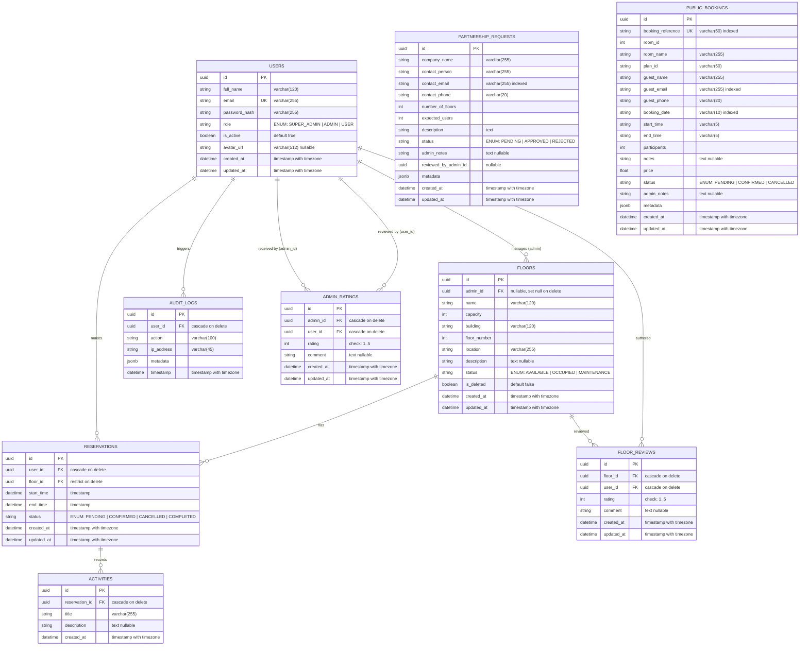

# Technical Documentation: Bookini Smart Floor Reservation System

Welcome to the technical documentation of **Bookini**, a production-ready, containerized Smart Floor Reservation System. This system allows users to reserve rooms, desks, and floors, while providing administrators with occupancy monitoring, audit logs, statistics, and observability.

---

## Table of Contents
1. [Project Overview & Business Goal](#1-project-overview--business-goal)
2. [Project Directory Tree](#2-project-directory-tree)
3. [Clean Architecture & Code Patterns](#3-clean-architecture--code-patterns)
4. [Database Schema (Mermaid)](#4-database-schema)
5. [Environment Variables Reference](#5-environment-variables-reference)
6. [Technology Stack Details](#6-technology-stack-details)
7. [CI/CD Pipeline Details](#7-cicd-pipeline-details)
8. [Database Seeding Model](#8-database-seeding-model)
9. [Key Fixes & Troubleshooting History](#9-key-fixes--troubleshooting-history)

---

## 1. Project Overview & Business Goal

Bookini is designed to solve office occupancy and reservation challenges. It features:
- **Interactive Floor Layouts**: 2D canvas editors for administrators to set up floors, desks, and equipment (projectors, plants, walls).
- **Self-Service Reservations**: Users can browse available places, select floors, view interactive plans, and reserve spaces.
- **Audit & Observability**: Complete audit logs of every sensitive action, paired with a full metrics/logs/tracing monitoring stack.
- **Containerized Deployments**: Run via Docker Compose, routed securely via Traefik.

---

## 2. Project Directory Tree

The workspace is organized into a modular multi-service repository structure:

```
bookini/
├── .github/
│   └── workflows/
│       └── ci.yml                     # CI/CD GitHub Actions Pipeline
├── admin-frontend/                    # Admin Panel (React/Vite/TS/MUI)
│   ├── src/
│   │   ├── app/                       # Routing, providers, and themes
│   │   └── features/                  # Module-focused workspaces and sections
│   ├── Dockerfile
│   └── vite.config.ts
├── backend/                           # API Backend (FastAPI/Python/SQLAlchemy)
│   ├── app/
│   │   ├── api/                       # API controllers and versioning
│   │   ├── core/                      # Configuration, seeding, logging, security
│   │   ├── domain/                    # Entities, DTOs, and schemas
│   │   ├── infrastructure/            # Database session and Minio configs
│   │   ├── models/                    # SQLAlchemy database entities
│   │   └── repositories/              # Repository query abstractions
│   ├── alembic/                       # DB migrations
│   ├── tests/                         # Pytest test suite
│   ├── Dockerfile
│   └── requirements.txt
├── frontend/                          # User Booking Panel (React/Vite/TS/MUI)
│   ├── src/                           # Source files
│   └── Dockerfile
├── monitoring/                        # Observability configuration
│   ├── grafana/                       # Dashboards and provisioned datasources
│   ├── loki/                          # Loki log aggregation configs
│   ├── prometheus/                    # Metric collection targets
│   └── promtail/                      # Log forwarding collector
├── traefik/                           # Reverse proxy configuration
├── docker-compose.yml                 # Master services orchestrator
├── docker-compose.prod.yml            # Production environment compose file
└── TECHNICAL_DOCUMENTATION.md         # This document
```

---

## 3. Clean Architecture & Code Patterns

The python backend follows **Clean Architecture** principles to separate concerns, isolate business logic, and ensure the core domain remains independent of external frameworks.

```
       ┌────────────────────────────────────────────────────────┐
       │                 Presentation Layer                     │
       │     - FastAPI Routes (app/presentation)                │
       │     - Input / Output Schemas (app/schemas)             │
       └───────────────────────────┬────────────────────────────┘
                                   │ (Calls)
                                   ▼
       ┌────────────────────────────────────────────────────────┐
       │                  Application Layer                     │
       │     - Business Services (app/services)                 │
       │     - State Stores / Core Handlers                     │
       └───────────────────────────┬────────────────────────────┘
                                   │ (Calls)
                                   ▼
       ┌────────────────────────────────────────────────────────┐
       │                  Infrastructure Layer                  │
       │     - DB Sessions (app/infrastructure)                 │
       │     - Repository Queries (app/repositories)            │
       │     - External Clients (MinioClient, Redis)            │
       └───────────────────────────┬────────────────────────────┘
                                   │ (Manipulates)
                                   ▼
       ┌────────────────────────────────────────────────────────┐
       │                     Domain Layer                       │
       │     - Core Database Models (app/models)                │
       │     - Enums & Value Objects (app/domain)               │
       └────────────────────────────────────────────────────────┘
```

### Layer Definitions & Data Flow
1. **Domain Layer** (`app/models` & `app/domain`): Defines core entities (e.g. `User`, `Reservation`, `Floor`) and basic enums (`UserRole`, `ReservationStatus`). Business rules live here and have zero external dependencies.
2. **Infrastructure Layer** (`app/infrastructure`): Implements database engines, external cloud adapters (e.g., `MinioClient` for S3 blueprint storage), and session scopes.
3. **Repository Layer** (`app/repositories`): Abstracts database queries using the Repository Pattern. All SQL and SQLAlchemy queries are contained here (e.g., `UserRepository`).
4. **Service Layer** (`app/services`): Coordinates business workflows and operations (e.g., verifying desk availability before creating a reservation). Services call repositories and map results.
5. **Presentation Layer** (`app/presentation` & `app/schemas`): The entrypoint of the application. It maps HTTP requests to services, validates request payloads with Pydantic schemas, and handles HTTP exceptions.

---

## 4. Database Schema

The database utilizes PostgreSQL 16. The database schema has been designed with strict constraints, foreign keys, cascade policies, and index optimizations. 

### Entity-Relationship Diagram (Mermaid)



---

### Detailed Database Tables Reference

#### 1. `users` Table
Stores user account profiles, system roles, authentication parameters, and profile details.
* **Indexes**: Primary Key `pk_users` (on `id`), Unique Index `uq_users_email` (on `email`).

| Column Name | Data Type | Constraints | Default Value | Description |
| :--- | :--- | :--- | :--- | :--- |
| `id` | `UUID` | Primary Key, Not Null | `uuid_generate_v4()` | Globally unique user identifier. |
| `full_name` | `VARCHAR(120)`| Not Null | None | The complete name of the user. |
| `email` | `VARCHAR(255)`| Unique, Not Null, Indexed | None | The unique login email address (case-insensitive). |
| `password_hash`| `VARCHAR(255)`| Not Null | None | Hashed password stored securely using bcrypt. |
| `role` | `VARCHAR(50)` | Not Null | `USER` | Role enum values: `SUPER_ADMIN`, `ADMIN`, `USER`. |
| `is_active` | `BOOLEAN` | Not Null | `TRUE` | Toggle flag for enabling/disabling access. |
| `avatar_url` | `VARCHAR(512)`| Nullable | `NULL` | Public path link to upload profile photo avatar. |
| `created_at` | `TIMESTAMP` | Not Null | `NOW()` | Timestamp indicating account registration time. |
| `updated_at` | `TIMESTAMP` | Not Null | `NOW()` | Timestamp showing last profile modifications. |

---

#### 2. `floors` Table
Represents floors within building coordinates mapped to workspace layouts.
* **Indexes**: Primary Key `pk_floors` (on `id`), Index `ix_floors_name` (on `name`), Index `ix_floors_building` (on `building`), Index `ix_floors_floor_number` (on `floor_number`).

| Column Name | Data Type | Constraints | Default Value | Description |
| :--- | :--- | :--- | :--- | :--- |
| `id` | `UUID` | Primary Key, Not Null | `uuid_generate_v4()` | Globally unique floor identifier. |
| `admin_id` | `UUID` | Foreign Key (`users.id`), Nullable | `NULL` | Manager in charge of the floor. Set null on user deletion. |
| `name` | `VARCHAR(120)`| Not Null, Indexed | None | Custom label or tag of the floor. |
| `capacity` | `INTEGER` | Not Null | None | Maximum number of people allowed simultaneously. |
| `building` | `VARCHAR(120)`| Not Null, Indexed | None | Building block or wing identifier. |
| `floor_number` | `INTEGER` | Not Null, Indexed | None | Numerical floor level (e.g. 0 for ground). |
| `location` | `VARCHAR(255)`| Not Null | None | Coordinates, office zone, or physical location info. |
| `description` | `TEXT` | Nullable | `NULL` | Description of the floor, equipment, or target teams. |
| `status` | `VARCHAR(50)` | Not Null | `AVAILABLE` | ENUM statuses: `AVAILABLE`, `OCCUPIED`, `MAINTENANCE`. |
| `is_deleted` | `BOOLEAN` | Not Null | `FALSE` | Soft deletion indicator flag. |
| `created_at` | `TIMESTAMP` | Not Null | `NOW()` | Time when floor metadata was registered. |
| `updated_at` | `TIMESTAMP` | Not Null | `NOW()` | Last floor details update timestamp. |

---

#### 3. `reservations` Table
Core reservations database linking workspace users with reserved office levels or rooms.
* **Constraints**: CHECK constraint `end_time > start_time` (validates end boundary occurs chronologically after starting boundary).
* **Indexes**: Primary Key `pk_reservations` (on `id`), Multi-column Index `ix_reservations_floor_time` (on `floor_id, start_time, end_time`), Index `ix_reservations_user_start` (on `user_id, start_time`).

| Column Name | Data Type | Constraints | Default Value | Description |
| :--- | :--- | :--- | :--- | :--- |
| `id` | `UUID` | Primary Key, Not Null | `uuid_generate_v4()` | Unique reservation identifier. |
| `user_id` | `UUID` | Foreign Key (`users.id`), Not Null | None | User booking reference. Cascade deletes on user removal. |
| `floor_id` | `UUID` | Foreign Key (`floors.id`), Not Null | None | target floor level. Restricts delete if reservations exist. |
| `start_time` | `TIMESTAMP` | Not Null | None | Starting date and time of reservation window. |
| `end_time` | `TIMESTAMP` | Not Null | None | Ending date and time of reservation window. |
| `status` | `VARCHAR(50)` | Not Null | `PENDING` | ENUM statuses: `PENDING`, `CONFIRMED`, `CANCELLED`, `COMPLETED`. |
| `created_at` | `TIMESTAMP` | Not Null | `NOW()` | Log entry booking creation time. |
| `updated_at` | `TIMESTAMP` | Not Null | `NOW()` | Reservation change timestamp. |

---

#### 4. `activities` Table
Documents meetings, events, or specific activities planned during reserved slots.
* **Indexes**: Primary Key `pk_activities` (on `id`), Index `ix_activities_reservation_id` (on `reservation_id`).

| Column Name | Data Type | Constraints | Default Value | Description |
| :--- | :--- | :--- | :--- | :--- |
| `id` | `UUID` | Primary Key, Not Null | `uuid_generate_v4()` | Unique activity identifier. |
| `reservation_id`| `UUID` | Foreign Key (`reservations.id`), Not Null | None | Associated reservation. Cascade deletes on reservation removal. |
| `title` | `VARCHAR(255)`| Not Null | None | Quick description or topic of the planned activity. |
| `description` | `TEXT` | Nullable | `NULL` | Rich details, materials required, or schedule. |
| `created_at` | `TIMESTAMP` | Not Null | `NOW()` | Timestamp representing database creation. |

---

#### 5. `audit_logs` Table
A security audit trail that logs all sensitive admin modifications, login actions, and deletion tasks.
* **Indexes**: Primary Key `pk_audit_logs` (on `id`), Index `ix_audit_logs_user_id` (on `user_id`), Index `ix_audit_logs_action` (on `action`).

| Column Name | Data Type | Constraints | Default Value | Description |
| :--- | :--- | :--- | :--- | :--- |
| `id` | `UUID` | Primary Key, Not Null | `uuid_generate_v4()` | Unique audit log row identifier. |
| `user_id` | `UUID` | Foreign Key (`users.id`), Not Null | None | User executing the action. Cascade deletes on user removal. |
| `action` | `VARCHAR(100)`| Not Null, Indexed | None | Categorized system action (e.g. `LOGIN`, `DELETE_USER`, `MUTATE_FLOOR`). |
| `ip_address` | `VARCHAR(45)` | Not Null | None | User IPv4 or IPv6 client address for audit tracking. |
| `metadata` | `JSON` | Not Null | `{}` | Key-value JSON payload listing parameters or target states. |
| `timestamp` | `TIMESTAMP` | Not Null | `NOW()` | Time indicating when the audited action took place. |

---

#### 6. `admin_ratings` Table
Stores user feedback scores evaluating office administrators and level managers.
* **Constraints**: CHECK constraint `rating >= 1 AND rating <= 5` (ensures valid feedback score limits), Unique Constraint `uq_admin_rating_admin_user` (prevents double reviews from the same user to the same admin).
* **Indexes**: Primary Key `pk_admin_ratings` (on `id`), Index `ix_admin_ratings_admin_id` (on `admin_id`), Index `ix_admin_ratings_user_id` (on `user_id`).

| Column Name | Data Type | Constraints | Default Value | Description |
| :--- | :--- | :--- | :--- | :--- |
| `id` | `UUID` | Primary Key, Not Null | `uuid_generate_v4()` | Unique rating identifier. |
| `admin_id` | `UUID` | Foreign Key (`users.id`), Not Null | None | Target admin user ID receiving the rating score. |
| `user_id` | `UUID` | Foreign Key (`users.id`), Not Null | None | Reviewer user ID posting the score rating. |
| `rating` | `INTEGER` | Not Null | None | Score rating value between 1 (poor) and 5 (excellent). |
| `comment` | `TEXT` | Nullable | `NULL` | Feedback text detailing reasons or improvement comments. |
| `created_at` | `TIMESTAMP` | Not Null | `NOW()` | Timestamp marking submission. |
| `updated_at` | `TIMESTAMP` | Not Null | `NOW()` | Date of rating edits. |

---

#### 7. `floor_reviews` Table
Allows corporate users to submit reviews and feedback on floor configurations, space facilities, and occupancy quality.
* **Constraints**: CHECK constraint `rating >= 1 AND rating <= 5`, Unique Constraint `uq_floor_review_floor_user` (restricts each reviewer to a single review per floor).
* **Indexes**: Primary Key `pk_floor_reviews` (on `id`), Index `ix_floor_reviews_floor_id` (on `floor_id`), Index `ix_floor_reviews_user_id` (on `user_id`).

| Column Name | Data Type | Constraints | Default Value | Description |
| :--- | :--- | :--- | :--- | :--- |
| `id` | `UUID` | Primary Key, Not Null | `uuid_generate_v4()` | Unique review identifier. |
| `floor_id` | `UUID` | Foreign Key (`floors.id`), Not Null | None | Targeted floor level. Cascade deletes on floor removal. |
| `user_id` | `UUID` | Foreign Key (`users.id`), Not Null | None | Author user ID. Cascade deletes on user removal. |
| `rating` | `INTEGER` | Not Null | None | Floor score rating between 1 and 5. |
| `comment` | `TEXT` | Nullable | `NULL` | Optional review note outlining desk quality or facilities. |
| `created_at` | `TIMESTAMP` | Not Null | `NOW()` | Date review was published. |
| `updated_at` | `TIMESTAMP` | Not Null | `NOW()` | Date review was edited. |

---

#### 8. `partnership_requests` Table
Tracks business development requests submitted by external companies seeking custom reservation space access.
* **Indexes**: Primary Key `pk_partnership_requests` (on `id`), Index `ix_partnership_email` (on `contact_email`), Index `ix_partnership_status` (on `status`).

| Column Name | Data Type | Constraints | Default Value | Description |
| :--- | :--- | :--- | :--- | :--- |
| `id` | `UUID` | Primary Key, Not Null | `uuid_generate_v4()` | Unique request identifier. |
| `company_name` | `VARCHAR(255)`| Not Null | None | Name of the prospective client company. |
| `contact_person`| `VARCHAR(255)`| Not Null | None | Full name of client contact representative. |
| `contact_email` | `VARCHAR(255)`| Indexed, Not Null | None | Email address of company contact. |
| `contact_phone` | `VARCHAR(20)` | Not Null | None | Phone number of company contact. |
| `number_of_floors`| `INTEGER` | Not Null | None | Number of floors requested to manage. |
| `expected_users`| `INTEGER` | Not Null | None | Total expected user seats required. |
| `description` | `TEXT` | Not Null | None | Detailed space request or business plan details. |
| `status` | `VARCHAR(50)` | Not Null | `PENDING` | ENUM statuses: `PENDING`, `APPROVED`, `REJECTED`. |
| `admin_notes` | `TEXT` | Nullable | `NULL` | Review response notes from Super Admin. |
| `reviewed_by_admin_id`| `UUID` | Nullable | `NULL` | Super Admin identifier performing reviews. |
| `metadata` | `JSON` | Not Null | `{}` | Extra parameter payload tracking metadata fields. |
| `created_at` | `TIMESTAMP` | Not Null | `NOW()` | Submission time of form. |
| `updated_at` | `TIMESTAMP` | Not Null | `NOW()` | Timestamp tracking administrative changes. |

---

#### 9. `public_bookings` Table
Registers Pay-As-You-Go single-slot space reservations submitted by guest/public non-registered users.
* **Indexes**: Primary Key `pk_public_bookings` (on `id`), Unique Index `uq_public_booking_ref` (on `booking_reference`), Index `ix_public_bookings_date` (on `booking_date`), Index `ix_public_bookings_email` (on `guest_email`), Index `ix_public_bookings_status` (on `status`).

| Column Name | Data Type | Constraints | Default Value | Description |
| :--- | :--- | :--- | :--- | :--- |
| `id` | `UUID` | Primary Key, Not Null | `uuid_generate_v4()` | Unique public booking identifier. |
| `booking_reference`| `VARCHAR(50)`| Unique, Indexed, Not Null | None | Auto-generated tracking reference string (e.g. `BKN-2026-X1`). |
| `room_id` | `INTEGER` | Not Null | None | Catalog identifier for public rooms. |
| `room_name` | `VARCHAR(255)`| Not Null | None | Cached room name for fast queries. |
| `plan_id` | `VARCHAR(50)` | Not Null | None | Subscription / booking plan identifier. |
| `guest_name` | `VARCHAR(255)`| Not Null | None | Full name of guest customer. |
| `guest_email` | `VARCHAR(255)`| Indexed, Not Null | None | Contact email address of guest. |
| `guest_phone` | `VARCHAR(20)` | Not Null | None | Contact phone number of guest. |
| `booking_date` | `VARCHAR(10)` | Indexed, Not Null | None | Date of booking in standard format `YYYY-MM-DD`. |
| `start_time` | `VARCHAR(5)`  | Not Null | None | Starting time of slot in standard format `HH:MM`. |
| `end_time` | `VARCHAR(5)`  | Not Null | None | Ending time of slot in standard format `HH:MM`. |
| `participants` | `INTEGER` | Not Null | None | Expected headcount attending room. |
| `notes` | `TEXT` | Nullable | `NULL` | Custom guest notes (e.g., catering, projector setup). |
| `price` | `FLOAT` | Not Null | None | Calculated cost rate paid or pending. |
| `status` | `VARCHAR(50)` | Not Null | `PENDING` | ENUM statuses: `PENDING`, `CONFIRMED`, `CANCELLED`. |
| `admin_notes` | `TEXT` | Nullable | `NULL` | Internal admin records or rejection justification notes. |
| `metadata` | `JSON` | Not Null | `{}` | Key-value logging data (e.g., payment ID, session token). |
| `created_at` | `TIMESTAMP` | Not Null | `NOW()` | Timestamp booking transaction log creation. |
| `updated_at` | `TIMESTAMP` | Not Null | `NOW()` | Last booking update timestamp. |

---

## 5. Environment Variables Reference

### Settings Loading Mechanism
Configuration variables are mapped in [config.py](file:///c:/Users/WISSEM%20HAMOUDI/Desktop/Projects/bookini/backend/app/core/config.py) using **Pydantic Settings** (`BaseSettings`). 
1. **Source Precedence**: The configuration parser searches for settings values in the system shell environment first, then cascades to search the `.env` configuration file in the application running directory.
2. **Strict Validation**: Pydantic validates data-types at boot. For instance:
   - `secret_key` raises validation errors if string length is under 16 characters.
   - `api_port` enforces constraints between `1` and `65535`.
3. **Fail-Fast Boot**: If any required configuration field (like `DATABASE_URL` or `SECRET_KEY`) is missing or fails validation checks, the FastAPI application logs critical errors and immediately aborts the server startup process.

---

### Detailed Service Configurations

#### 1. Core Backend Configuration (`backend/`)

| Variable Name | Type / Format | Default Value | Required | Description / Usage |
| :--- | :--- | :--- | :--- | :--- |
| `APP_ENV` | `development \| staging \| production` | `development` | No | Dictates CORS settings, dev/prod routing priorities, and stack warning configurations. |
| `LOG_LEVEL` | `DEBUG \| INFO \| WARNING \| ERROR` | `INFO` | No | Filters output console logs. Set `DEBUG` locally to inspect database transactions. |
| `API_HOST` | IPv4 address string | `0.0.0.0` | No | Binding network adapter address for Uvicorn listener. |
| `API_PORT` | `1..65535` | `8000` | No | Port number on which the API engine serves requests. |
| `DATABASE_URL` | SQLAlchemy Connection URL | None | **Yes** | Sync/Async engine connection URL for PostgreSQL. Format: `postgresql+psycopg://[user]:[password]@[host]:[port]/[database]`. |
| `REDIS_URL` | Redis Connection URL | `redis://redis:6379/0` | No | Connection parameters for Redis caching, session states, and request throttling. |
| `SECRET_KEY` | Hexadecimal String (min 16 chars) | None | **Yes** | Cryptographic key used to sign JWT access and refresh tokens. Must be a secure random hex key in production. |
| `JWT_ALGORITHM` | Hashing Algorithm string | `HS256` | No | Signing algorithm selected for JWT encryption. Defaults to symmetric SHA-256. |
| `ACCESS_TOKEN_EXPIRE_MINUTES`| Integer | `15` | No | Lifetime duration for the signed access tokens before token expiry. |
| `REFRESH_TOKEN_EXPIRE_DAYS`| Integer | `7` | No | Lifetime duration of refresh tokens stored in cookies or headers. |
| `CORS_ALLOW_ORIGINS` | JSON list of domains | *Preset list* | No | Authorized CORS header source domains (must include frontend addresses). |

---

#### 2. MinIO S3 Object Storage Configuration

| Variable Name | Type / Format | Default Value | Required | Description / Usage |
| :--- | :--- | :--- | :--- | :--- |
| `MINIO_ENDPOINT` | Hostname and Port | `minio:9000` | No | Address coordinates pointing to the object storage client server. |
| `MINIO_ACCESS_KEY` | Plaintext string | `minioadmin` | No | Access username matching the MinIO target credentials. |
| `MINIO_SECRET_KEY` | Plaintext string | `minioadmin` | No | Private authorization token matching the MinIO target credentials. |
| `MINIO_BUCKET` | String | `bookini` | No | Target S3 bucket folder where blueprint plans and profile photos are uploaded. |
| `MINIO_SECURE` | Boolean | `false` | No | Instructs client libraries to use HTTPS secure SSL connection loops instead of HTTP. |

---

#### 3. Database Bootstrap Seeding Configuration

| Variable Name | Type / Format | Default Value | Required | Description / Usage |
| :--- | :--- | :--- | :--- | :--- |
| `SEED_SUPER_ADMIN` | Boolean | `true` | No | Toggle checking whether to seed the master database with a Super Admin. |
| `SEED_SUPER_ADMIN_EMAIL` | Email address string | `superadmin@bookiwa7dek.com` | No | The default email credential generated on initialization for Super Admin. |
| `SEED_SUPER_ADMIN_PASSWORD`| Plaintext string | `SuperAdmin123456!` | No | Password credential used for the bootstrapped Super Admin account. |
| `SEED_DEFAULT_USERS` | Boolean | `false` | No | Controls whether default test users are seeded. Kept to `false` in production. |

---

#### 4. Frontend & Proxy Deployment Configuration (`frontend/` & `admin-frontend/`)

| Variable Name | Type / Format | Default Value | Required | Description / Usage |
| :--- | :--- | :--- | :--- | :--- |
| `DOMAIN_NAME` | Fully Qualified Domain Name (FQDN) | None | **Yes** | Root domain (e.g. `bookini.example.com`) routing reverse proxy targets. |
| `BACKEND_IMAGE` | Docker Hub Image Tag | None | **Yes (CI)** | Fully qualified Docker tag for backend container version (injected during CI). |
| `FRONTEND_IMAGE` | Docker Hub Image Tag | None | **Yes (CI)** | Fully qualified Docker tag for user booking portal (injected during CI). |
| `ADMIN_FRONTEND_IMAGE`| Docker Hub Image Tag | None | **Yes (CI)** | Fully qualified Docker tag for admin frontend workspace (injected during CI). |

---

#### 5. Monitoring & Obsv Stack Configuration (`monitoring/`)

| Variable Name | Type / Format | Default Value | Required | Description / Usage |
| :--- | :--- | :--- | :--- | :--- |
| `GRAFANA_ADMIN_USER` | Plaintext string | None | **Yes** | Admin username utilized by Grafana service for control dashboard logins. |
| `GRAFANA_ADMIN_PASSWORD`| Secure plaintext password string | None | **Yes** | Admin password utilized by Grafana service for control dashboard logins. |

---

## 6. Technology Stack Details

### Frontend & Admin Portal
- **Framework**: React 19 (via Vite 8 for fast building).
- **Language**: TypeScript (with strict compiler flags including `verbatimModuleSyntax`).
- **Styling**: Material UI (MUI) for a cohesive and clean design system.
- **State Management**: `@tanstack/react-query` for API caching and mutation states.
- **Testing**: Vitest + `@testing-library/react` running in a `jsdom` environment.

### Backend
- **Framework**: FastAPI (built on top of Starlette and Uvicorn).
- **ORM & DB Connection**: SQLAlchemy (Async Engine) + Alembic (migration manager).
- **Linting & Code Style**: Ruff (replaces Black, Flake8, and isort).
- **Testing**: Pytest + `pytest-asyncio`.
- **Security Scan**: `pip-audit` for resolving PyPI dependencies vulnerability.

### Infrastructure & Reverse Proxy
- **Containerizer**: Docker Engine + Compose.
- **Reverse Proxy / Router**: Traefik v3 (integrates Let's Encrypt for automatic HTTPS/TLS).
- **S3 Storage**: MinIO (local S3 mockup for mock floor plan blueprints).

### Observability
- **Prometheus**: Scrapes metrics from `/metrics` endpoint.
- **Grafana**: Visualizes metrics through provisioned dashboards (System, DB, and Business metrics).
- **Loki & Promtail**: Forward and aggregate stdout container logs.
- **cAdvisor & Node Exporter**: Track server memory, CPU, and running container stats.

---

## 7. CI/CD Pipeline Details

The GitHub Actions pipeline is defined in [.github/workflows/ci.yml](file:///c:/Users/WISSEM%20HAMOUDI/Desktop/Projects/bookini/.github/workflows/ci.yml). 

```
 ┌───────────────┐      ┌───────────────┐      ┌────────────────────┐
 │  Push / PR to │ ───> │ Quality Gates │ ───> │   Docker Images    │
 │master/develop │      │(Test & Lint)  │      │(Build, Scan, Push) │
 └───────────────┘      └───────────────┘      └─────────┬──────────┘
                                                         │
                                                         ▼
                                               ┌────────────────────┐
                                               │Staging Deploy (VPS)│
                                               │- Dynamic Checkout  │
                                               │- Compose Pull & Up │
                                               └────────────────────┘
```

### Flow Execution Steps:
1. **Quality Gates (Parallel Runs)**:
   - **Backend Quality**: Runs `Ruff` checks, `Pytest` suite, and `pip-audit` on the python environment.
   - **Frontend Quality**: Runs `ESLint`, compiles typescript, runs `Vitest` unit tests, and compiles the production bundles.
   - **Admin Frontend Quality**: Runs `ESLint`, compiles typescript, and runs `Vitest` unit tests.
2. **Build, Scan, and Push (Only on pushes to `master` or `develop`)**:
   - Builds Docker images for the three services using Docker Buildx and caches intermediate layers (`type=gha`).
   - Logs into Docker Hub using credentials stored in GitHub Secrets.
   - **Trivy Image Scan (`aquasecurity/trivy-action@v0.36.0`)**: Scans all three images for HIGH and CRITICAL vulnerabilities. If any unignored OS-level vulnerability is found, the build fails.
   - Pushes secure images to Docker Hub (tagged with both `latest` and target `${{ github.sha }}`).
3. **Staging Deploy (Only on pushes to `master` or `develop`)**:
   - Connects to the Staging VPS via SSH (`appleboy/ssh-action@v1.0.3`).
   - **Dynamic Git Checkout**: Executes `git fetch`, `git checkout`, and `git pull` on the remote server using the dynamic branch name **`${{ github.ref_name }}`**. This ensures that the correct compose configurations are loaded (e.g. including the `admin-frontend` service when deploying `develop`).
   - Runs `docker compose pull` and restarts the container orchestration cluster.

---

## 8. Database Seeding Model

Bookini uses a single-point startup seeding model to minimize test database pollution and maintain clean production credentials:

- **Super Admin Account Seeding**: 
  On application startup, the service check in [seed.py](file:///c:/Users/WISSEM%20HAMOUDI/Desktop/Projects/bookini/backend/app/core/seed.py) verifies if the database has a Super Admin account matching `settings.seed_super_admin_email`. If none exists, it creates the admin account with the hashed password configured in `settings.seed_super_admin_password`.
- **Default Users Seeding Removal**:
  The historical `seed_default_users` function (which created mock user/admin accounts such as `admin@bookiwa7dek.com` and `user@bookiwa7dek.com`) was removed. This ensures that the production database starts with exactly one account: the Super Admin platform director.

---

## 9. Key Fixes & Troubleshooting History

Here is a summary of the key configuration and compilation resolutions implemented:

### Vitest Test & Context Fixes
- **Missing Provider Context**: Wrapped the `LoginPage` component within `<ColorModeProvider>` inside `login-page.test.tsx` (in both `frontend` and `admin-frontend`) to avoid the context hook error `useColorMode must be used within ColorModeProvider`.
- **ESM Directory Imports in Node**: Added `server.deps.inline: ['@mui/material', 'react-transition-group']` to `vite.config.ts`. This resolves Node's strict ESM restriction `Directory import ... is not supported` by forcing Vitest to compile these folders through Vite's pipeline.
- **Mismatching Assertions**: Corrected test expectations in `admin-frontend/src/app/router.test.tsx` to search for `/sign in to continue/i` (the actual login header) rather than `/welcome back/i`.

### TypeScript Compilations
- **Type-only Imports**: Refactored `dashboard-page.tsx` to import `ReservationItem` as a type (`import type { ReservationItem }`) to comply with strict TS compilation when `verbatimModuleSyntax` is enabled.
- **ElementType Casts**: Cast dropdown selections (`e.target.value as ElementType`) in `floor-management-section.tsx` to satisfy compiler checks preventing generic `string` inputs where a specific literal union type is expected.

### Docker & Trivy Scanning
- **Debian Base Image Patches**: Added `&& apt-get upgrade -y` inside `backend/Dockerfile`.
- **Alpine Base Image Patches**: Added `RUN apk upgrade --no-cache` inside `frontend/Dockerfile` and `admin-frontend/Dockerfile` final Nginx stages.
  - *Result*: These package upgrades patch system libraries (like `openssl` and `libssl3`) on build time, successfully clearing the Trivy security scan.

### Monitoring & Grafana
- **Loki Alert Rule Error**: Configured `jsonData: manageAlerts: false` for the Loki datasource in `datasources.yml`. This instructs Grafana to skip loading rule configs from Loki's Ruler API (which is off), resolving the persistent Rule Loading Error banner in the Grafana interface.
