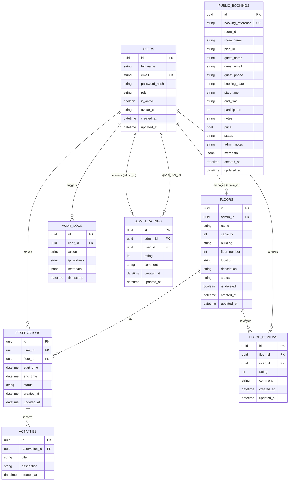

# 05 – Database Schema

## Overview

Bookini uses **PostgreSQL 16** as its primary data store. The schema is managed via **Alembic** migrations and accessed through an **async SQLAlchemy** ORM layer.

---

## Entity-Relationship Diagram



---

## Table Reference

### `users`

Stores all user accounts including guests, admins, and the super admin.

| Column | Type | Constraints | Description |
|--------|------|-------------|-------------|
| `id` | `UUID` | PK, NOT NULL | Auto-generated unique identifier |
| `full_name` | `VARCHAR(120)` | NOT NULL | User's full display name |
| `email` | `VARCHAR(255)` | UNIQUE, NOT NULL | Login email (case-insensitive) |
| `password_hash` | `VARCHAR(255)` | NOT NULL | bcrypt-hashed password |
| `role` | `VARCHAR(50)` | NOT NULL, default `USER` | `SUPER_ADMIN`, `ADMIN`, or `USER` |
| `is_active` | `BOOLEAN` | NOT NULL, default `TRUE` | Account enabled/disabled flag |
| `avatar_url` | `VARCHAR(512)` | NULL | Path to MinIO-stored avatar |
| `created_at` | `TIMESTAMP TZ` | NOT NULL, default NOW() | Account creation time |
| `updated_at` | `TIMESTAMP TZ` | NOT NULL, default NOW() | Last update time |

**Indexes:** `pk_users` (id), `uq_users_email` (email)

---

### `floors`

Represents managed floors within an organisation's buildings.

| Column | Type | Constraints | Description |
|--------|------|-------------|-------------|
| `id` | `UUID` | PK, NOT NULL | Unique floor identifier |
| `admin_id` | `UUID` | FK → `users.id`, NULL | Admin managing this floor (SET NULL on delete) |
| `name` | `VARCHAR(120)` | NOT NULL | Floor label |
| `capacity` | `INTEGER` | NOT NULL | Max occupancy |
| `building` | `VARCHAR(120)` | NOT NULL | Building identifier |
| `floor_number` | `INTEGER` | NOT NULL | Level number (0 = ground) |
| `location` | `VARCHAR(255)` | NOT NULL | Location description |
| `description` | `TEXT` | NULL | Optional detailed description |
| `status` | `VARCHAR(50)` | NOT NULL, default `AVAILABLE` | `AVAILABLE`, `OCCUPIED`, `MAINTENANCE` |
| `is_deleted` | `BOOLEAN` | NOT NULL, default `FALSE` | Soft-delete flag |
| `created_at` | `TIMESTAMP TZ` | NOT NULL, default NOW() | Creation timestamp |
| `updated_at` | `TIMESTAMP TZ` | NOT NULL, default NOW() | Last update timestamp |

**Indexes:** `pk_floors` (id), `ix_floors_name`, `ix_floors_building`, `ix_floors_floor_number`

---

### `reservations`

Core table linking users to floor time reservations.

| Column | Type | Constraints | Description |
|--------|------|-------------|-------------|
| `id` | `UUID` | PK, NOT NULL | Unique reservation identifier |
| `user_id` | `UUID` | FK → `users.id`, CASCADE DELETE | Reserving user |
| `floor_id` | `UUID` | FK → `floors.id`, RESTRICT DELETE | Reserved floor |
| `start_time` | `TIMESTAMP` | NOT NULL | Reservation start |
| `end_time` | `TIMESTAMP` | NOT NULL | Reservation end (must be > start_time) |
| `status` | `VARCHAR(50)` | NOT NULL, default `PENDING` | `PENDING`, `CONFIRMED`, `CANCELLED`, `COMPLETED` |
| `created_at` | `TIMESTAMP TZ` | NOT NULL, default NOW() | Creation timestamp |
| `updated_at` | `TIMESTAMP TZ` | NOT NULL, default NOW() | Last update timestamp |

**Constraints:** CHECK `end_time > start_time`  
**Indexes:** `pk_reservations`, `ix_reservations_floor_time` (floor_id, start_time, end_time), `ix_reservations_user_start`

---

### `activities`

Documents activities or events planned during reserved time slots.

| Column | Type | Constraints | Description |
|--------|------|-------------|-------------|
| `id` | `UUID` | PK, NOT NULL | Unique activity identifier |
| `reservation_id` | `UUID` | FK → `reservations.id`, CASCADE DELETE | Parent reservation |
| `title` | `VARCHAR(255)` | NOT NULL | Activity title |
| `description` | `TEXT` | NULL | Optional rich description |
| `created_at` | `TIMESTAMP TZ` | NOT NULL, default NOW() | Creation timestamp |

---

### `audit_logs`

Security trail of all sensitive system actions.

| Column | Type | Constraints | Description |
|--------|------|-------------|-------------|
| `id` | `UUID` | PK, NOT NULL | Unique log entry ID |
| `user_id` | `UUID` | FK → `users.id`, CASCADE DELETE | User who triggered the action |
| `action` | `VARCHAR(100)` | NOT NULL | Action type (e.g. `LOGIN`, `REGISTER`, `DELETE_USER`) |
| `ip_address` | `VARCHAR(45)` | NOT NULL | Client IP address |
| `metadata` | `JSONB` | NOT NULL, default `{}` | Key-value payload with action context |
| `timestamp` | `TIMESTAMP TZ` | NOT NULL, default NOW() | When the action occurred |

**Indexes:** `pk_audit_logs`, `ix_audit_logs_user_id`, `ix_audit_logs_action`

---

### `admin_ratings`

User feedback scores for administrators.

| Column | Type | Constraints | Description |
|--------|------|-------------|-------------|
| `id` | `UUID` | PK, NOT NULL | Unique rating ID |
| `admin_id` | `UUID` | FK → `users.id`, CASCADE DELETE | Rated admin |
| `user_id` | `UUID` | FK → `users.id`, CASCADE DELETE | Rating author |
| `rating` | `INTEGER` | NOT NULL, CHECK 1–5 | Score (1 = poor, 5 = excellent) |
| `comment` | `TEXT` | NULL | Optional review text |
| `created_at` | `TIMESTAMP TZ` | NOT NULL | Submission timestamp |
| `updated_at` | `TIMESTAMP TZ` | NOT NULL | Last edit timestamp |

**Constraints:** UNIQUE `(admin_id, user_id)` – one review per user per admin  
**Indexes:** `pk_admin_ratings`, `ix_admin_ratings_admin_id`, `ix_admin_ratings_user_id`

---

### `floor_reviews`

User reviews and ratings for individual floors.

| Column | Type | Constraints | Description |
|--------|------|-------------|-------------|
| `id` | `UUID` | PK, NOT NULL | Unique review ID |
| `floor_id` | `UUID` | FK → `floors.id`, CASCADE DELETE | Reviewed floor |
| `user_id` | `UUID` | FK → `users.id`, CASCADE DELETE | Review author |
| `rating` | `INTEGER` | NOT NULL, CHECK 1–5 | Score (1–5) |
| `comment` | `TEXT` | NULL | Optional review note |
| `created_at` | `TIMESTAMP TZ` | NOT NULL | Published timestamp |
| `updated_at` | `TIMESTAMP TZ` | NOT NULL | Last edit timestamp |

**Constraints:** UNIQUE `(floor_id, user_id)` – one review per user per floor  
**Indexes:** `pk_floor_reviews`, `ix_floor_reviews_floor_id`, `ix_floor_reviews_user_id`

---

### `public_bookings`

Pay-as-you-go bookings submitted by public (unauthenticated) guests.

| Column | Type | Constraints | Description |
|--------|------|-------------|-------------|
| `id` | `UUID` | PK, NOT NULL | Unique booking ID |
| `booking_reference` | `VARCHAR(50)` | UNIQUE, NOT NULL | Auto-generated reference (e.g. `BK-20260625-abc123`) |
| `room_id` | `INTEGER` | NOT NULL | Catalog room identifier |
| `room_name` | `VARCHAR(255)` | NOT NULL | Cached room name |
| `plan_id` | `VARCHAR(50)` | NOT NULL | Booking plan identifier |
| `guest_name` | `VARCHAR(255)` | NOT NULL | Guest full name |
| `guest_email` | `VARCHAR(255)` | NOT NULL, indexed | Guest email |
| `guest_phone` | `VARCHAR(20)` | NOT NULL | Guest phone |
| `booking_date` | `VARCHAR(10)` | NOT NULL, indexed | Date in `YYYY-MM-DD` format |
| `start_time` | `VARCHAR(5)` | NOT NULL | Start time in `HH:MM` format |
| `end_time` | `VARCHAR(5)` | NOT NULL | End time in `HH:MM` format |
| `participants` | `INTEGER` | NOT NULL | Expected headcount |
| `notes` | `TEXT` | NULL | Guest special requirements |
| `price` | `FLOAT` | NOT NULL | Calculated cost |
| `status` | `VARCHAR(50)` | NOT NULL, default `PENDING` | `PENDING`, `CONFIRMED`, `CANCELLED` |
| `admin_notes` | `TEXT` | NULL | Internal admin notes |
| `metadata` | `JSONB` | NOT NULL, default `{}` | Additional payload |
| `created_at` | `TIMESTAMP TZ` | NOT NULL | Booking creation timestamp |
| `updated_at` | `TIMESTAMP TZ` | NOT NULL | Last update timestamp |

**Indexes:** `pk_public_bookings`, `uq_public_booking_ref` (booking_reference), `ix_public_bookings_date`, `ix_public_bookings_email`, `ix_public_bookings_status`

---

## Migrations

Run with Alembic:

```bash
# Apply all migrations
alembic upgrade head

# Create a new migration from model changes
alembic revision --autogenerate -m "add new_column to users"

# Roll back one migration
alembic downgrade -1

# View current migration state
alembic current
```

---

*Next: [06-monitoring.md](./06-monitoring.md)*
